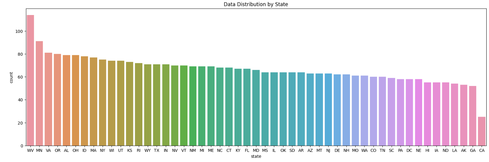
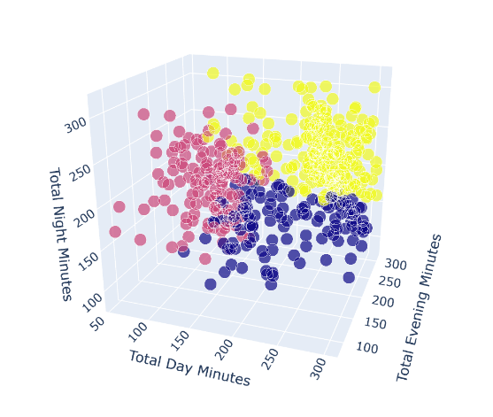
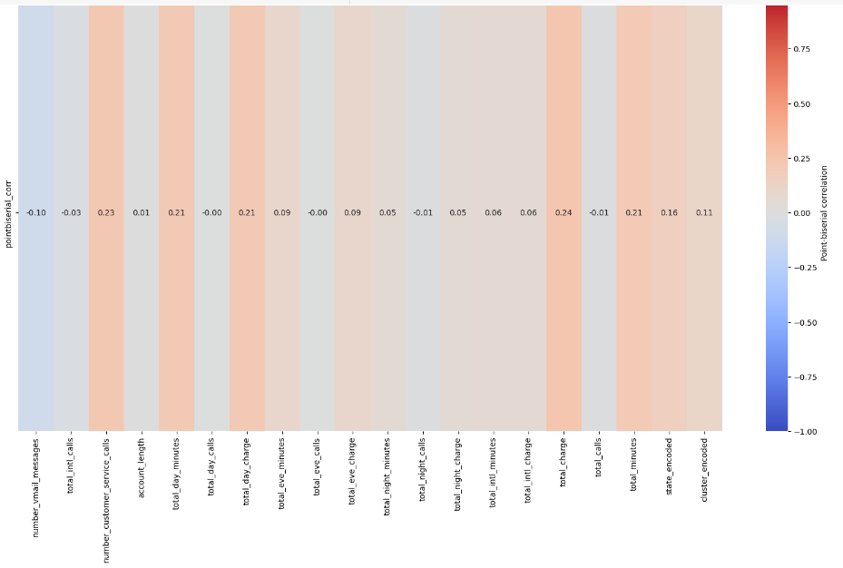
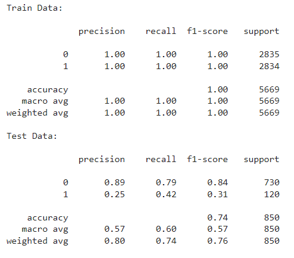
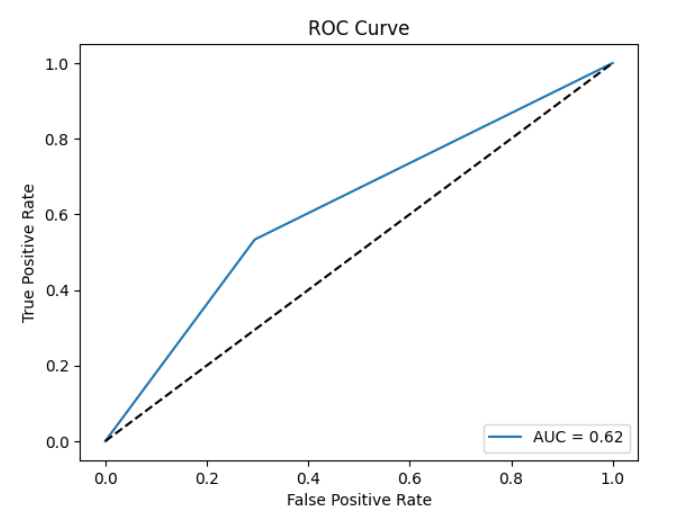

<!DOCTYPE html>
<html lang="en">
<head>
    <meta charset="UTF-8">
</head>
<body>
  

  
  
<h2>TELECOM CHURN PREDICTION</h2>
  
<h2>Authors</h2>
<a href="https://github.com/natalia-gcvs">@natalia-gcvs</a>
  
<h2>Metodologia</h2>
  
  A metodologia utilizada nesse projeto é o CRISP-DM que involve as etapas ilustradas abaixo.

  
  
  <ol dir="auto">
<li><a href="#entendimento-do-negocio">Entendimento do negócio</a></li>
<li><a href="#entendimento-dos-dados">Entendimento dos dados</a></li>
<li><a href="#preparacao-dos-dados">Preparação dos dados</a></li>
<li><a href="#modelagem">Modelagem</a></li>
<li><a href="#avaliacao-do-modelo">Avaliação do modelo</a></li>
<li><a href="#deployment">Implantação/Deployment</a></li>
<li><a href="#limitacoes">Limitações e pontos a serem melhorados</a></li>
  </ol>
  
<h2 id="entendimento-do-negocio"> 1. Entendimento do Negócio</h2> 
  <dl>
<dl>
  <dt>1.1. Objetivo do projeto:</dt> 
  <dd><b>Objetivo: </b>Entender claramente o objetivo do projeto, que neste caso é identificar antecipadamente os clientes com maior probabilidade de cancelar os serviços da empresa de telecomunicações (churn), a fim de tomar medidas proativas para mantê-los satisfeitos e evitar perdas de negócios.</dd>
  
  <dt>1.2. Contexto do negócio:</dt> 
  <dd><b>Objetivo: </b>Compreender o contexto em que o projeto está inserido, incluindo a situação competitiva do mercado, os tipos de serviços oferecidos, as políticas de preços, os canais de atendimento e a percepção dos clientes sobre a empresa. No entanto, uma das limitações deste projeto é que a fonte de dados disponível é o Kaggle e a empresa é anônima, o que restringe nossa capacidade de aprofundar a análise do contexto de negócios.</dd>
  
  <dt>1.3. Fontes de dados:</dt> 
  <dd><b>Objetivo: </b>Identificar as fontes de dados disponíveis para o projeto, que podem incluir dados de faturamento, perfil dos clientes, histórico de uso dos serviços, informações sobre reclamações e cancelamentos de serviço, entre outros. Assim como na etapa anterior, estamos limitados às variáveis contidas no dataset, cuja fonte é o Kaggle.</dd>
  
  <dt>1.4. Variáveis de interesse:</dt> 
  <dd><b>Objetivo: </b>Selecionar as variáveis mais relevantes para o problema de churn, como por exemplo, tempo de contrato, valor do faturamento, tipo de serviço contratado, frequência de uso, histórico de cancelamento, entre outros.</dd>
  
  <dt>1.5. Stakeholders:</dt> 
  <dd><b>Objetivo: </b>Identificar as partes interessadas no projeto, incluindo a equipe de marketing, a equipe de atendimento ao cliente, a equipe de vendas e os próprios clientes, a fim de entender como os resultados do projeto podem impactar esses stakeholders. Essa etapa também não é possível de ser realizada dada a fonte de dados.</dd>
  
  <dt>1.6. Métricas de sucesso:</dt> 
  <dd><b>Objetivo: </b>Definir as métricas de sucesso para o projeto. Para lidar com dados desbalanceados, que é o caso, é importante escolher uma métrica de sucesso adequada que leve em consideração a classe minoritária, como a recall e a precision. Como nosso objetivo é identificar corretamente todos os casos de churn, mesmo que isso resulte em alguns falsos positivos, a recall é a métrica mais importante. Isso ocorre porque é mais prejudicial perder um cliente do que investir em um que não deixaria a empresa. No entanto, é importante lembrar que essa decisão depende do contexto do negócio e da capacidade financeira da empresa para lidar com os investimentos necessários.</dd>
</dl>

  
  <h2 id="entendimento-dos-dados">2. Entendimento dos dados</h2>
  
  <dl>
<dt>2.1. Coleta de dados:</dt>
<dd><b>Objetivo:</b> Identificar as fontes de dados relevantes para o projeto e coletar os dados necessários.
  <dd>Essa etapa se resume ao download do dataset no 
  <a href="https://www.kaggle.com/datasets/arashnic/telecom-churn-dataset">Kaggle</a></dd>
 
<dt>2.2. Descrição dos dados:</dt>
    <dd><b>Objetivo:</b> Descrever os dados para entender melhor suas características, como tamanho, tipo de dados, distribuição, presença de missing values ou outliers.</dd>
    <dd>Dataset Variables:</dd>
    <ol>
    <li>state: The state where the customer resides (string).</li>
    <li>account_length: The number of days the customer has had an active account (integer).</li>
    <li>area_code: The three-digit area code for the customer's phone number (string).</li>
    <li>international_plan: Whether the customer has an international plan or not (string, "yes" or "no").</li>
    <li>voice_mail_plan: Whether the customer has a voicemail plan or not (string, "yes" or "no").</li>
    <li>number_vmail_messages: The number of voicemail messages the customer has (integer).</li>
    <li>total_day_minutes: The total number of minutes the customer used during the day (float).</li>
    <li>total_day_calls: The total number of calls the customer made during the day (integer).</li>
    <li>total_day_charge: The total charge for the day calls (float).</li>
    <li>total_eve_minutes: The total number of minutes the customer used during the evening (float).</li>
    <li>total_eve_calls: The total number of calls the customer made during the evening (integer).</li>
    <li>total_eve_charge: The total charge for the evening calls (float).</li>
    <li>total_night_minutes: The total number of minutes the customer used during the night (float).</li>
    <li>total_night_calls: The total number of calls the customer made during the night (integer).</li>
    <li>total_night_charge: The total charge for the night calls (float).</li>
    <li>total_intl_minutes: The total number of international minutes the customer used (float).</li>
    <li>total_intl_calls: The total number of international calls the customer made (integer).</li>
    <li>total_intl_charge: The total international charge (float).</li>
    <li>number_customer_service_calls: The number of customer service calls the customer made (integer).</li>
    <li>churn: Whether the customer churned or not (string, "yes" or "no").</li>
    </ol>
      
<dd>O dataset possui 4250 entradas, das quais:</dd>
<dd>- Somente 14% dos dados representam a classe de clientes que cancelaram o serviço.</dd>
<dd>- O dataset não possui missing values.</dd>
<dd>- Para lidar com outliers, utilizamos uma técnica de imputação, uma vez que eles eram poucos. Não poderíamos simplesmente excluí-los, já que estamos trabalhando com um dataset pequeno e não queremos perder informações relevantes. Além disso, verificamos que as entradas com outliers são válidas. Utilizamos a técnica de <a href="https://www.statisticshowto.com/winsorize/">Winsorization</a> para lidar com esses outliers, que consiste em recortar os valores discrepantes para os percentis mínimo e máximo.</dd>
      
<dt>2.5. Identificação de dados sensíveis:</dt> 
  <dd><b>Objetivo: </b>Identificar se existem dados sensíveis que precisam ser tratados de forma especial para garantir a privacidade e a segurança dos clientes.</dd> 
      <dd>Não há dados sensíveis nesse projeto.</dd>

<dt>2.6. Análise exploratória:</dt> 
    <dd><b>Objetivo:</b>Realizar uma análise exploratória dos dados para entender melhor a estrutura dos dados e como as variáveis estão relacionadas.</dd>
     <dd><b>Métodos</b></dd>
     <dd><b>Análise Univariada</b></dd>
      <ul>
         <li>Variável Target</li>
          

         
          

          
A analise univariada da distribuicao da variavel target demontrou um desbalanco entres as duas clasess, mais precisamente 86% dos dados sao relativos a cliente que deixaram a empresa enquanto que 14% sao de clientes que nao deixaram.

Além disso, esse desequilíbrio na distribuição das classes indica que a classe de clientes que deixaram a empresa é significativamente maior em comparação com a classe de clientes que permaneceram, o que pode apresentar desafios na construção de modelos de previsão precisos e na obtenção de resultados balanceados.

         <li>Variáveis Númericas</li>
          

         
          
A distribuição da maioria das variáveis se assemelha a uma distribuição normal, com exceção das variáveis binárias "total_intl_calls" e "number_customer_service_calls". Estas duas variáveis apresentam uma distribuição discreta ou com valores extremos, o que pode indicar um padrão de comportamento distinto em relação às demais variáveis contínuas.

          

         <li>Variáveis Categóricas</li>
          

         
          

         
          

          
O estado com o maior número de entradas é West Virginia, enquanto o estado com o menor número de entradas é a Califórnia. Os demais estados possuem aproximadamente a mesma quantidade de entradas.

No que diz respeito à distribuição das classes dentro da variável "região", ela é equilibrada, o que significa que as classes estão relativamente balanceadas em termos de quantidade.

Por outro lado, é possível observar um desbalanceamento de classes na variável "county", onde a área da Baía de São Francisco possui o dobro de entradas em comparação com as outras duas áreas.

É importante destacar que o desbalanceamento das classes pode resultar no modelo aprendendo a priorizar as classes mais prevalentes durante o treinamento. Isso pode levar a um problema de generalização, onde o modelo pode não se sair bem ao fazer previsões para estados com menos entradas disponíveis.

      </ul>
      <dd><b>Análise Bivariada</b></dd>
      
 Para a Análise Bivariada seguimos a seguinte hipóteses:

      
<ul>
<li>
Hipótese 1: Clientes com tempo de conta mais longo têm menos probabilidade de churn. Isso ocorre porque clientes que estão com a empresa há mais tempo podem estar mais satisfeitos com o serviço e ter estabelecido uma lealdade à empresa.
</li>
    

    

O gráfico não fornece conclusões definitivas, mas é possível observar uma taxa de churn mais alta para clientes que estão com a empresa entre 50 e 150 dias. Para confirmar essa suspeita, calculamos o coeficiente ponto bisserial, o t-value, e concluímos que podemos afirmar com 95% de confiança que há uma correlação positiva entre as duas variáveis. No entanto, é importante ressaltar que a magnitude dessa correlação é muito fraca.

Portanto, embora exista uma relação estatisticamente significativa entre o tempo de permanência do cliente e a taxa de churn, essa correlação é relativamente fraca. Isso significa que outros fatores podem ter uma influência maior no comportamento de churn dos clientes, e é importante considerar esses fatores adicionais ao desenvolver estratégias de retenção de clientes.

<li>
Hipótese 2: Clientes com um plano internacional têm menos probabilidade de churn. Isso ocorre porque clientes que possuem um plano internacional podem ter uma necessidade maior pelos serviços da empresa e podem ser menos propensos a mudar para um concorrente.
</li>
    

    

O gráfico revelou uma tendência oposta à hipótese 2, demonstrando que os clientes com plano internacional têm uma maior propensão a deixar a empresa, uma vez que a taxa de rotatividade é quatro vezes maior para esse grupo.

    
<li>
Hipótese 3: Clientes com um plano de caixa postal e um número maior de mensagens de caixa postal têm menos probabilidade de churn. Isso ocorre porque clientes que usam a caixa postal podem ter um maior engajamento com os serviços da empresa e podem ser mais propensos a permanecer com a empresa.
</li>
    

    

A taxa de rotatividade (churn) para clientes com um plano de caixa postal é de 0,074, o que é menor do que a taxa de rotatividade para clientes sem um plano de caixa postal (0,164). Isso sugere que ter um plano de caixa postal pode estar associado a taxas de rotatividade mais baixas.

Além disso, a média de mensagens de caixa postal para os clientes que cancelaram é de 4,358, o que é menor do que a média de mensagens de caixa postal para os clientes que não cancelaram (8,129). Isso sugere que um uso menor da caixa postal pode estar associado a taxas de rotatividade mais altas.

O resultado do teste qui-quadrado de 43,645 com um valor de p de 0,000 sugere que há uma associação estatisticamente significativa entre ter um plano de caixa postal e a taxa de rotatividade, assim como entre o uso da caixa postal e a taxa de rotatividade. Isso significa que é improvável que essas associações sejam devidas ao acaso.

    
<li>
Hipótese 4: Clientes que fazem mais chamadas para o serviço de atendimento ao cliente são mais propensos a churn. Isso ocorre porque clientes que precisam fazer várias chamadas para o serviço de atendimento ao cliente podem ter tido uma experiência negativa com o serviço da empresa e podem ser mais propensos a mudar para um concorrente.
</li>
    
 

Com base no gráfico, observa-se uma associação entre o número de chamadas para o serviço de atendimento e a taxa de rotatividade. De forma geral, verifica-se que os clientes que deixaram o serviço apresentaram um maior número de chamadas para o serviço de atendimento em comparação com aqueles que permaneceram.

    
<li>
Hipótese 5: Clientes que usam o serviço com mais frequência durante o dia, à tarde e à noite têm menos probabilidade de churn. Isso ocorre porque clientes que usam o serviço com mais frequência podem ter uma necessidade maior pelos serviços da empresa e podem ser menos propensos a mudar para um concorrente.
</li>
    

Para visualizar melhor como o uso do serviço influencia a taxa de rotatividade, clusterizamos os dados em três grupos com base na quantidade de minutos usados durante o dia, tarde e noite. Os resultados em termos de taxa de rotatividade foram os seguintes:

<ul><li>Taxa de rotatividade por cluster:<ul><li>Cluster 0: 0,117925</li><li>Cluster 1: 0,110741</li><li>Cluster 2: 0,193152</li></ul></li></ul>
  
 

Ao analisar o gráfico de segmentação dos clientes por uso, é possível observar que o Cluster 2 se destaca dos demais, apresentando uma taxa de rotatividade quase o dobro dos outros grupos. Além disso, esse grupo se caracteriza por ter um maior total de minutos usados durante os três períodos do dia.

Esses resultados indicam que há uma relação entre o uso do serviço e a taxa de rotatividade, onde o Cluster 2, com um maior volume de minutos utilizados, apresenta uma taxa de rotatividade mais elevada em comparação aos outros grupos.

    
<li>
Hipótese 6: Clientes que são cobrados mais por suas chamadas, tanto durante o dia quanto à noite, são mais propensos a churn. Isso ocorre porque clientes que são cobrados mais podem estar insatisfeitos com a política de preços da empresa e podem ser mais propensos a mudar para um concorrente.
</li>
    
 
    

Clientes que são cobrados mais por suas chamadas têm maior probabilidade de cancelar o serviço. Embora exista apenas uma pequena diferença, como mostrado no gráfico, entre o valor total das cobranças para os clientes que cancelaram e aqueles que não cancelaram.

    
<li>
Hipótese 7: Clientes podem cancelar o serviço (churn) se mudarem para uma área onde seu serviço de telecomunicações atual não está disponível.
</li>
    

Para determinar isso, precisaríamos reunir informações sobre a disponibilidade dos serviços da empresa de telecomunicações em cada região, estado e condado, o que não é possível uma vez que o nome da empresa objeto dessa análise não é revelado. Além disso, também precisaríamos da área do novo cliente.

    
 
    

    

No entanto, com base nas informações que temos, analisamos a taxa de rotatividade por estado, região e código de área do condado e constatamos que:
<ul><li>Nova Jersey e Califórnia têm uma taxa de rotatividade superior a 30%.</li><li>O Nordeste tem a maior taxa de rotatividade, aproximadamente 16%.</li><li>Não houve diferença significativa entre a taxa de rotatividade para as 3 diferentes áreas de código.</li></ul>
</ul>
      

Conclusões Gerais: Em geral, podemos observar que algumas variáveis não são muito preditivas, uma vez que não há diferenças muito significativas entre os grupos. Além disso, podemos resumir as conclusões da seguinte forma:
<ul><li>Clientes com um período de conta mais longo têm uma leve tendência a cancelar o serviço em comparação com clientes com período de conta mais curto, embora o efeito não seja forte.</li><li>Clientes com um plano internacional têm uma maior probabilidade de cancelar o serviço.</li><li>Clientes com um plano de correio de voz e um maior número de mensagens de correio de voz têm uma menor probabilidade de cancelar o serviço.</li><li>O número de chamadas para o serviço de atendimento ao cliente está associado ao cancelamento do serviço nesse conjunto de dados.</li><li>Clientes que usam o serviço com mais frequência durante o dia, à noite e durante a madrugada têm uma maior probabilidade de cancelar o serviço.</li><li>Clientes que são cobrados mais por suas chamadas têm uma maior probabilidade de cancelar o serviço. No entanto, há apenas uma pequena diferença entre as cobranças totais para clientes que cancelaram e aqueles que não cancelaram o serviço.</li><li>New Jersey e Califórnia têm uma taxa de cancelamento acima de 30%.</li><li>A região Nordeste tem a maior taxa de cancelamento, aproximadamente 16%.</li><li>Não houve diferença significativa na taxa de cancelamento entre as 3 áreas de código distintas.</li></ul>
      
<h2 id="preparacao-dos-dados">3. Preparação dos dados</h2>
      
<dt>3.1. Transformação dos dados:</dt>
      <dd><b>Objetivo: </b>Nesta etapa, os dados são modificados ou reestruturados para atender às necessidades específicas da análise. Isso pode incluir a criação de novas variáveis, a normalização ou padronização de dados numéricos, a codificação de variáveis categóricas, entre outros.s</dd>
      
Dado o contexto, uma informação relevante a ser adicionada é a explicação sobre a importância da codificação target encoding para lidar com variáveis categóricas de alta cardinalidade.

Ao utilizar o target encoding, substituímos os valores categóricos por valores numéricos com base na variável alvo, o que proporciona uma representação mais compacta e eficiente dos dados. Esse tipo de codificação é especialmente útil quando lidamos com variáveis categóricas que possuem um grande número de categorias, como no caso da variável "state" com suas 51 classes.

Ao contrário da codificação one-hot, em que cada categoria se torna uma nova coluna binária, o target encoding mantém as informações originais dentro de uma única característica, preservando a estrutura e a representatividade dos dados. Isso evita a criação de conjuntos de dados esparsos e de alta dimensionalidade, que podem impactar negativamente a performance e eficiência dos modelos de análise.

Portanto, o uso do target encoding se mostra uma escolha adequada para lidar com variáveis categóricas de alta cardinalidade, permitindo uma representação mais eficiente dos dados e evitando os problemas associados à codificação one-hot em tais situações.

<dt>3.2. Seleção de variáveis:</dt> 
      <dd><b>Objetivo: </b>Selecionar as variáveis mais relevantes para o problema de churn, levando em consideração a correlação com a variável de interesse, a redundância entre as variáveis e a facilidade de obtenção dos dados.</dd>
 
Utilizamos o coeficiente de correlação ponto-bisserial para determinar a correlação entre as variáveis contínuas e a variável alvo (binária). Em seguida, utilizamos o coeficiente de correlação phi para determinar a correlação entre as variáveis binárias e a variável alvo. Por fim, aplicamos a técnica de Random Forest para calcular a importância das variáveis.

  
Considerando o contexto descrito, seria relevante acrescentar a explicação sobre a utilização dessas técnicas e suas implicações na análise dos dados.

Ao utilizar o coeficiente de correlação ponto-bisserial e o coeficiente de correlação phi, buscamos entender a relação entre as variáveis independentes (contínuas e binárias, respectivamente) e a variável dependente (binária), ou seja, se existe uma associação entre elas. Esses coeficientes fornecem medidas de correlação que nos auxiliam a compreender a direção e a força dessas relações.

Já o uso da técnica Random Forest feature importance é realizado com o objetivo de avaliar a importância relativa das variáveis na predição da variável alvo. Por meio dessa técnica, podemos identificar quais variáveis têm maior influência na determinação do resultado desejado, fornecendo insights valiosos para a análise e interpretação dos resultados.

Assim, ao utilizar essas técnicas em conjunto, é possível obter uma visão mais completa sobre as relações entre as variáveis e identificar quais são as mais relevantes para a predição do resultado desejado no contexto do estudo em questão.

      
      
  
  
  
      

Para a seleção final das variáveis, levamos em consideração os coeficientes de correlação e a importância atribuída por meio da técnica Random Forest Feature Importance. Após essa análise, removemos as variáveis redundantes, resultando em um total de 8 variáveis selecionadas:
<ul><li>'total_day_minutes'</li><li>'state_encoded'</li><li>'number_customer_service_calls'</li><li>'international_plan'</li><li>'cluster_encoded'</li><li>'number_vmail_messages'</li><li>'high_day_usage'</li><li>'voice_mail_plan'</li></ul>
Essas variáveis foram identificadas como as mais relevantes para a análise e predição do resultado desejado, considerando seus coeficientes de correlação com a variável alvo e sua importância no contexto do modelo Random Forest.

      
<dt>3.3. Balanceamento de dados:</dt> 
      <dd><b>Objetivo: </b>O objetivo do balanceamento de dados é corrigir a distribuição desigual das classes, buscando uma representação mais equilibrada e justa para o treinamento de modelos preditivos.</dd>
      
Para melhor compreender as características do desbalanceamento deste conjunto de dados, utilizamos a técnica chamada t-SNE para visualizar os dados em um gráfico. Através dessa visualização, identificamos não apenas o desbalanceamento, mas também a sobreposição de classes, o que torna o problema de classificação ainda mais desafiador.

A fim de lidar com esse desbalanceamento, aplicamos o método de undersampling chamado Instance Hardness Threshold (IHT). O Instance Hardness Threshold (IHT) é uma técnica de undersampling que visa lidar com o desbalanceamento de classes em conjuntos de dados. Ele se baseia na ideia de identificar e remover amostras consideradas "hard" ou difíceis de classificar. No entanto, antes de aplicar o IHT, realizamos uma etapa de oversampling, usando uma técnica chamada <a href="">Adasyn</a>, uma vez que estamos trabalhando com um conjunto de dados relativamente pequeno.

Em seguida, ajustamos o modelo utilizando diferentes algoritmos e estratégias, buscando identificar qual obteve melhor desempenho na classificação dos dados. Essa abordagem nos permite explorar diferentes modelos e técnicas, avaliando qual apresenta uma performance mais promissora no contexto específico deste conjunto de dados.

      
   
   

<dt id="modelagem">4. Modelagem</dt>
<dd><b>Objetivo: </b>Construir modelos de mineração de dados que sejam capazes de resolver o problema de negócio ou atingir os objetivos do projeto</dd>
 p>A seleção dos algoritmos de machine learning considerou as limitações do conjunto de dados, que são: tamanho pequeno, desbalanceamento, variáveis pouco preditivas e sobreposição de classes. As técnicas escolhidas foram:
<ul><li>
Árvores de Decisão: Adequadas para conjuntos de dados desbalanceados, com sobreposição de classes e variáveis pouco preditivas. Selecionam automaticamente as variáveis relevantes e oferecem interpretabilidade dos resultados.
</li><li>
Voting Classifier: Beneficia-se do desbalanceamento, variáveis pouco preditivas e sobreposição de classes, combinando diferentes modelos de classificação para lidar com essas características específicas. Melhora a precisão geral da predição.
</li><li>
Random Forest: Combina várias árvores de decisão, lidando com sobreposição de classes, desbalanceamento e variáveis pouco preditivas. Fornece avaliação robusta da importância das variáveis.
</li><li>
Support Vector Machines (SVM): Eficaz em conjuntos de dados pequenos, desbalanceados e com sobreposição de classes. Encontra hiperplanos de separação utilizando funções de kernel.
</li><li>
K-Nearest Neighbor (k-vizinhos mais próximos): Adequado para predição de churn devido à capacidade de lidar com desbalanceamento, capturar padrões com variáveis pouco preditivas e ajustar parâmetros, além de utilizar técnicas de pré-processamento para tratar sobreposição de classes. Ajustes de parâmetros e pré-processamento são importantes para obter resultados otimizados, considerando as limitações específicas do conjunto de dados.
</li></ul>
     
Entre os algoritmos testados, a maioria dos algoritmos sofreram overfitting, ajustando-se muito bem aos dados de treinamento, mas com dificuldade de generalização para novos dados.

Dentre os algoritmos testados, optamos pelo Voting Classifier, que apresentou um equilíbrio melhor entre as medidas de recall e precisão para ambas as classes (0 e 1), mesmo diante do overfitting observado em todos os modelos. Os resultados são apresentados abaixo."

    

As imagens exibem os resultados das métricas de Precisão, Recall e F1. É evidente que houve uma melhora significativa no desempenho do modelo após a aplicação da técnica Instance Hardness Threshold, porém ainda não é o ideal. Além disso, testamos o desempenho do modelo após a aplicação da técnica ADASYN, tanto isoladamente quanto combinada com o IHT. No entanto, todos os modelos testados apresentaram um melhor desempenho quando não houve oversampling e quando a técnica do IHT foi aplicada.

    

Esse comportamento pode ser atribuído a algumas razões. Primeiramente, a aplicação do Instance Hardness Threshold (IHT) ajudou a eliminar instâncias mais ruidosas ou de difícil classificação, melhorando a qualidade dos dados de treinamento. Isso resultou em um modelo mais preciso e com melhor capacidade de generalização.

Por outro lado, a aplicação da técnica ADASYN pode ter introduzido um viés nos dados ao gerar instâncias sintéticas para a classe minoritária. Isso significa que as instâncias sintéticas podem não ser representativas da verdadeira distribuição da classe minoritária. Essas instâncias podem ter características que não refletem fielmente os padrões e a variabilidade dos exemplos reais da classe.

Além disso, ao combinar o ADASYN com o IHT, pode haver uma interação complexa entre as duas técnicas, resultando em um desempenho inferior. A geração de instâncias sintéticas pode introduzir ruído adicional nos dados e prejudicar a separabilidade das classes.

Portanto, os resultados indicam que, para esse caso especificamente, a não aplicação de oversampling e a utilização apenas da técnica IHT levaram a um desempenho superior do modelo.

Não foi realizada uma tentativa de ajuste fino do modelo, uma vez que, geralmente, aumentar a complexidade do modelo não costuma melhorar a sua performance e pode piorar a situção do overfitting.

    
<dt id="avaliacao-do-modelo">5. Avaliação do modelo</dt>
    

    

AUC de 0,62: O valor de AUC indica que o modelo possui algum poder discriminatório em distinguir entre as classes positiva e negativa. No entanto, sugere que o desempenho preditivo do modelo pode ser moderado, uma vez que um valor de AUC de 0,5 representa uma suposição aleatória e valores mais altos indicam um melhor desempenho.

    

    

Matriz de Confusão: A matriz de confusão fornece mais informações sobre as previsões do modelo. Vejamos como podemos interpretar os valores:

Verdadeiros Negativos (VN): O modelo previu corretamente 515 instâncias como churn negativo.
Falsos Positivos (FP): O modelo previu incorretamente 215 instâncias como churn positivo quando na verdade eram negativas.
Falsos Negativos (FN): O modelo previu incorretamente 56 instâncias como churn negativo quando na verdade eram positivas.
Verdadeiros Positivos (VP): O modelo previu corretamente 64 instâncias como churn positivo.
Considerando que a previsão de churn é o interesse principal e que classificar todas as entradas positivas com precisão é importante, devemos focar no desempenho na classe positiva. Nesse caso, o desempenho do modelo pode ser melhorado, pois ele possui um número relativamente maior de falsos negativos (56) em comparação com os verdadeiros positivos (64).

      
  </dl>

 

  
 

</body>
</html>

